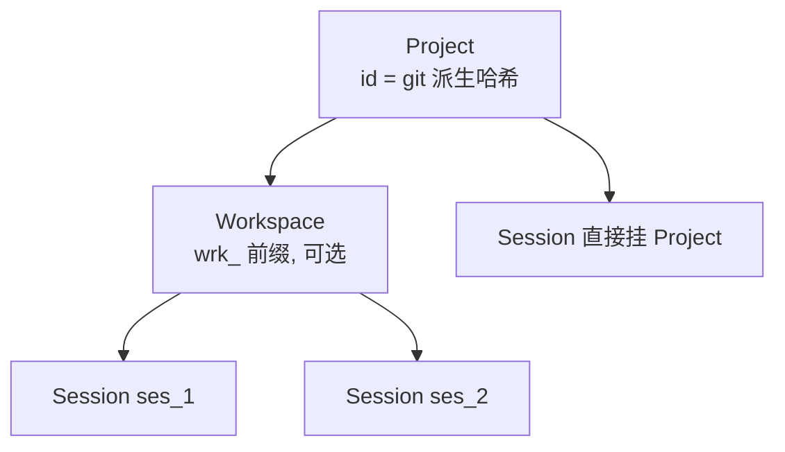
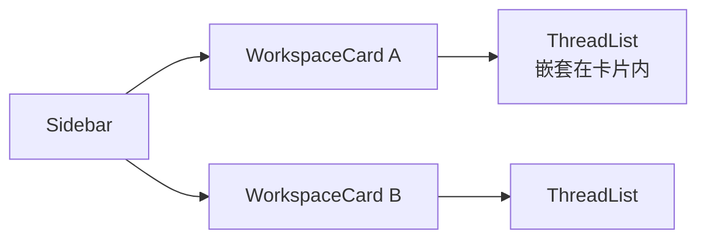
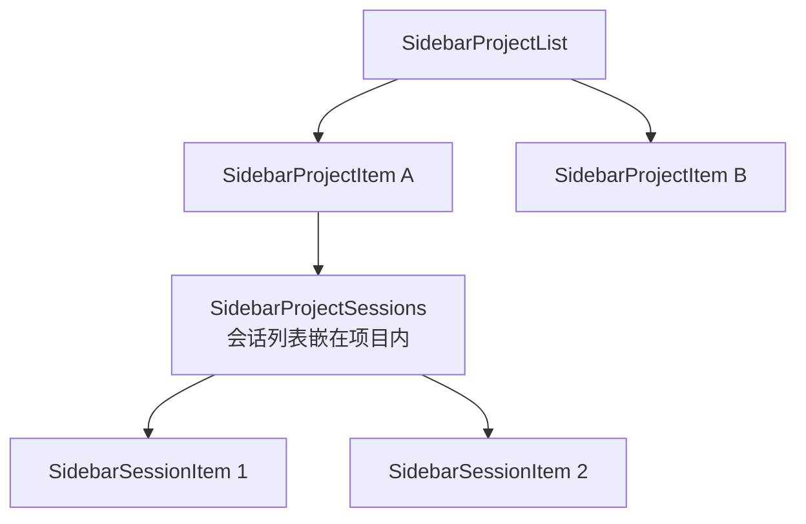
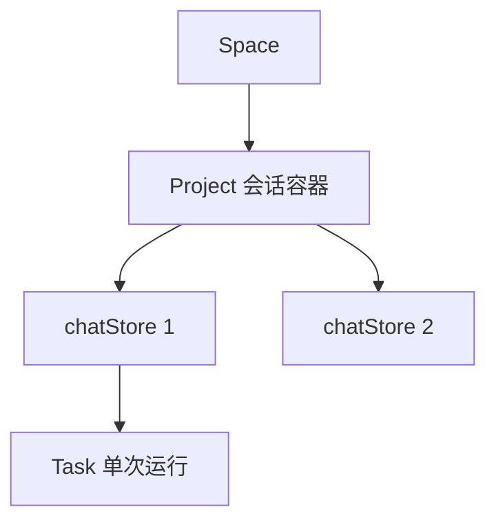
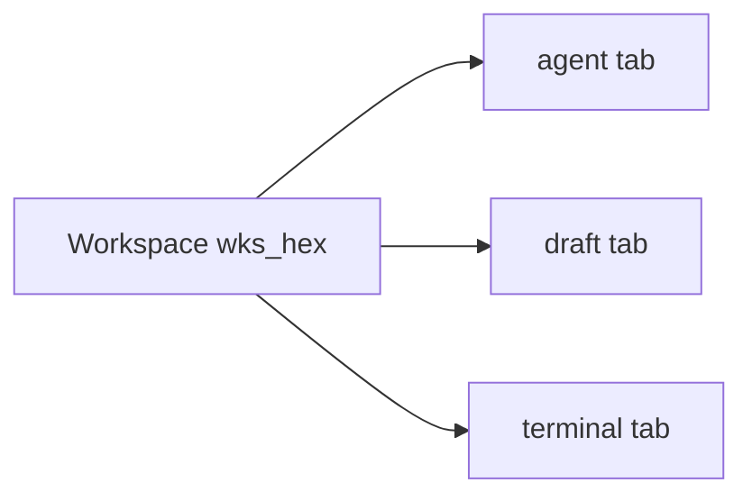

# 桌面端「工作空间 → 会话」导航逻辑对照分析

> [!abstract] 一句话结论
> 5 个参考开源项目（opencode / desktop-cc-gui / claudecodeui / eigent / paseo）**一致地**实现了「会话从属于工作空间 + 同空间可多会话」的两级导航；而 harness_agent 目前**两点都没做到**（任务列表未按空间过滤、同空间只能单任务）。本文件逐项对照，给出可落地的改进方向。

---

## 一、分析对象

| 项目 | 前端框架 | 桌面壳 | 后端/存储 | 与 harness_agent 关系 |
|------|---------|--------|----------|----------------------|
| **harness_agent**（基线） | React 19 | **Tauri 2** | Rust + localStorage/内存 | 本文对照对象 |
| opencode | SolidJS | Electron | SQLite (drizzle) | 最权威（官方开源 agent） |
| desktop-cc-gui | React 19 | **Tauri 2** | Rust | **最同栈** |
| claudecodeui | React 18 | Electron | Express + SQLite | 会话嵌套侧栏最直观 |
| eigent | React 18 | Electron | Python 后端 | 层级最细（四层） |
| paseo | React Native/Expo | Electron | Express + WS | 移动/桌面同源 |

---

## 二、六项目横向对比总表

| 维度 | harness_agent | opencode | desktop-cc-gui | claudecodeui | eigent | paseo |
|------|--------------|----------|----------------|--------------|--------|-------|
| **一级实体** | Workspace | Project | Workspace | Project | Space | Workspace |
| **二级实体** | Task（监督任务） | Session（可 fork） | Thread | Session | Project→Chat→Task | Agent（tab） |
| **会话从属工作空间？** | ❌ 列表未过滤 | ✅ 外键 | ✅ 按 workspace 键 | ✅ 外键 | ✅ spaceId | ⚠️ 弱归属 |
| **同空间多会话？** | ❌ 单任务 | ✅ 多标签+fork | ✅ 多 tab | ✅ 无唯一约束 | ✅ 多 Project | ✅ 多 tab |
| **身份标识** | 路径为主 + `ws-`id | git 派生哈希 | UUID + 路径 | UUID + 路径 | 纯前端 uuid | `wks_`/`prj_` |
| **切空间实现** | setActiveId | 路由参数(worktree) | activeWorkspaceId | 嵌套树 | activeSpaceId | 路由(id) |
| **持久化** | localStorage + 内存 | SQLite | Rust + 磁盘 | SQLite | 前端 + Python | JSON 文件 |

> [!tip] 观察
> 5 个参考项目**无一例外**做到了「会话从属于工作空间」和「同空间多会话」。这是桌面 coding agent 的**共性架构**，不是个别选择。

---

## 三、各项目导航结构详解

### 3.1 opencode —— 三级外键 + git 派生 ID

- **Project**：`{id, worktree, vcs, name, icon, time}`，`id` 由 **git remote URL 哈希 / 根提交 sha** 派生，无 git 时为 `"global"`。UI 路由键却是 **worktree 路径（base64）**。
- **Session**：`{id, parentID(可 fork), projectID, workspaceID?, ...}`，`id` = `ses_`+时间序。列表只显示根会话（`roots:true`，过滤 fork）。
- **导航**：侧栏按 project.worktree 渲染，点项目 → 换路由 → 会话列表随 directory 参数换源。
- **启示**：身份用「git 派生 ID + 路径做 UI 键」双轨，多会话靠 **标签页 + fork**。

### 3.2 desktop-cc-gui —— 与 harness_agent 同栈，最值得抄

- **Workspace**：`{id(UUID), name, path, kind: main|worktree, parentId, ...}`，`id` 由 **Rust `Uuid::new_v4()`** 生成，`path` 只作去重键。
- **Thread**：`{id, name, threadKind, physicalPath, engineSource, parentThreadId, familyId}`，`id` = 引擎原生 id + 前缀（如 `claude:<uuid>`）。
- **状态组织**（关键）：`threadsByWorkspace: Record<workspaceId, ThreadSummary[]>` + `activeThreadIdByWorkspace`（**每个 workspace 各自记住当前会话**）。
- **导航**：无 URL 路由，纯 React 状态驱动；侧栏 WorkspaceCard 内嵌 ThreadList；多会话呈顶栏 tab（`workspaceId+threadId`）。
- **启示**：`threadsByWorkspace` 这种「按 workspaceId 分片的 map」是「切空间=切会话列表」最直接的实现范式，**harness_agent 缺的正是这个分片**。

### 3.3 claudecodeui —— 会话嵌套在项目节点内

- **数据模型**：`projects` 表 `{project_id(UUID PK), project_path(UNIQUE)}`；`sessions` 表 `{session_id(UUID PK), provider_session_id, project_path(FK→projects, ON DELETE SET NULL), jsonl_path}`。
- **从属关系**：会话表用 `project_path` **外键**，`ON DELETE SET NULL`（删项目不删会话，会话变"未分配"）。
- **同项目多会话**：是，无唯一约束，可并行。
- **启示**：`ON DELETE SET NULL` 这个细节很关键——**删空间不删会话**，比 `CASCADE`（opencode 用）更保守。

### 3.4 eigent —— 四层 + 纯 uuid 解耦目录

- **Space**：`{id, name, sourceType: blank|folder|legacy, rootPath?, status}`，`id` = 前端生成 `space_时间戳-随机`。**目录只是 folder 型 Space 的可选 rootPath，身份与目录彻底解耦**。
- **层级最深**：`Space → Project（会话容器）→ chatStore（聊天）→ Task（单次运行）`。
- **切空间**：单一 `activeSpaceId` 派生 → 侧栏按 `activeSpaceId` 过滤 Project 列表。
- **启示**：纯 uuid 标识 + 「切空间=派生状态」是另一种范式；四层模型对应「空间内可多个持久会话、每会话可多次运行」的语义。

### 3.5 paseo —— workspace 一级导航 + agent 多 tab

- **Workspace**：`{id(wks_hex), projectId, projectRootPath, workspaceDirectory, ...}`，JSON 文件持久化。
- **Agent（会话）**：`{id(uuid), provider, cwd, workspaceId(可选), status, ...}`，**以 tab 活在 workspace 内**（不是侧栏项）。
- **从属关系**：弱归属（`workspaceId` 可选，无归属的 agent 也存在）。
- **同 workspace 多会话**：是（tab strip 多 agent/draft/terminal + split pane）。
- **启示**：身份全 uuid 化（`wks_`/`prj_`/agentId），路径仅元数据；多会话 = workspace 内多 tab。

---

## 四、harness_agent 现状与差距（诚实盘点）

### 4.1 现状

| 概念 | 实现 | 位置 |
|------|------|------|
| Workspace | `{id, path, name, position, createdAt}`，localStorage | `src/lib/workspaces.ts` |
| Task（监督任务） | `{id, work_dir, kind, status, rounds, last_reason, started_at_ms}`，后端内存 | `src-tauri/src/lib.rs` |
| 侧栏 | WorkspaceSidebar（空间列表+切换+重命名） | `src/components/WorkspaceSidebar.tsx` |
| 任务列表 | TaskList（**全局未过滤**） | `src/App.tsx:694` |
| 身份 | `path` 为主键，`samePath` 去重 | `src/lib/workspaces.ts` |

### 4.2 差距（与 5 个参考项目的共性对照）

> [!warning] 差距 1：任务列表未按激活空间过滤
> `App.tsx:694` 的 `<TaskList tasks={tasks}>` 传的是 `fetchTasks()` 全局任务列表，**没有 `filter(t => samePath(t.work_dir, activeWorkspace.path))`**。切空间后任务列表不变 —— 对应「会话从属工作空间」缺失。

> [!warning] 差距 2：同空间只能单任务
> 后端 `busy_workdirs` 按 `work_dir` 互斥锁（同目录只能跑一个），前端启动表单单一 `runningTask`。对应「同空间多会话」缺失。

> [!warning] 差距 3：终端 pane 单实例
> `TerminalWorkspace` 切空间只改 `projectWorkDir` 字符串，已启动 PTY 会话不重建，切空间看到的还是同一个对话。

> [!note] 差距 4：身份用路径而非独立 ID
> 5 个参考项目**全部**用独立 UUID/派生 ID 做关联键（路径只做物理锚点）；harness_agent 用 `path` 做身份，`samePath` 去重。这在「重命名空间 / 移动目录」时会出问题。

---

## 五、可落地的改进方向（供接手者参考）

> [!info] 按优先级排序，非本轮实施

1. **任务列表按激活空间过滤**（最小改动，修差距 1）
   - 参照 desktop-cc-gui 的 `threadsByWorkspace` 范式：任务列表改为按 `activeWorkspace.path` 过滤，或后端 `list_supervise_tasks` 加 `work_dir` 参数。

2. **同空间多任务**（修差距 2，改动较大）
   - 后端 `busy_workdirs` 从「按 work_dir 互斥」改为「按 task_id」或「每空间 N 任务上限」；前端表单支持"再开一个任务"。

3. **身份解耦**（长期）
   - Workspace 已有 `ws-` id，应让 `id` 成为唯一关联键、`path` 降级为元数据（参照 eigent/paseo 的纯 uuid 派）。

4. **删空间不删任务**（借鉴 claudecodeui 的 `ON DELETE SET NULL`）
   - 当前任务注册表是内存态，若未来落盘，删空间时任务应"未分配"而非级联删除。

---

## 六、结论

| 结论 | 说明 |
|------|------|
| 共性架构 | 「会话从属工作空间 + 同空间多会话」是桌面 coding agent 的**标配** |
| 最该抄的 | **desktop-cc-gui**（同 Tauri 栈）的 `threadsByWorkspace` 分片 + UUID 身份 |
| 最权威 | **opencode** 的 git 派生 ID + 三级外键 |
| harness_agent 差距 | 集中在「任务列表过滤」和「同空间多任务」两点，方向明确 |

> [!quote] 一句话
> 五个项目都证明了一件事：**「工作空间」是导航的一级实体，「会话/任务」必须挂在它下面、且能开多个**。harness_agent 已经有一半（工作空间实体），缺的另一半是「按空间隔离任务 + 同空间多任务」。
